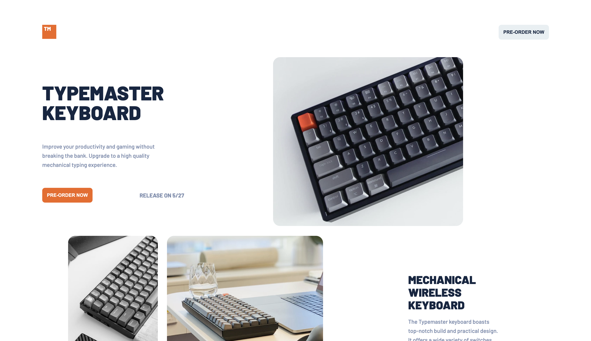

# Frontend Mentor - Clipboard Landing Page Solution

Esta es una solución al [Typemaster PreLaunch Landing Page](https://www.frontendmentor.io/challenges/typemaster-prelaunch-landing-page-J6-Yj5J-X). Los desafíos de Frontend Mentor te ayudan a mejorar tus habilidades de programación mediante la construcción de proyectos realistas.

## Overview

### El Challenge

Los usuarios deberían poder:

- Ver el diseño óptimo del sitio según el tamaño de pantalla de su dispositivo.
- Ver los estados de desplazamiento para todos los elementos interactivos en la página.

### Screenshot

### Links

- Solution URL: [https://github.com/jeremiasingla/frontendmentor-clipbloardlanding-solution.git](https://github.com/jeremiasingla/frontendmentor-clipbloardlanding-solution.git)
- Live Site URL: [https://jeremiasingla.github.io/frontendmentor-clipbloardlanding-solution/](https://jeremiasingla.github.io/frontendmentor-clipbloardlanding-solution/)

## Proceso

### Hecho con

- HTML5 Semantico
- CSS Custom Properties
- Flexbox
- CSS Grid

## Autor

- Web - [Jeremias Ingla](https://github.com/jeremiasingla/)
- Frontend Mentor - [@jeremiasingla](https://www.frontendmentor.io/profile/jeremiasingla)
